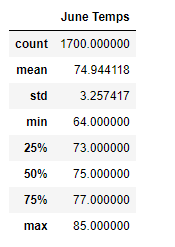
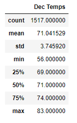

# Weather Statistics Analysis

## **Overview of the Weather Statistics Analysis**: the purpose of this analysis was to better understand weather patterns on Oahu during the months of June versus December, in order to determine if the surf and ice cream shop business is sustainable year-round. 

### In order to develop the statistics for both June and December, we used a combination of Python, Pandas functions and methods, and SQLAlchemy to filter the date column of the Measurements table in our hawaii.sqlite database. We used the same approach in both deliverables, whereby we filtered the date column to show either month 6 for Deliverable 1, or month 12 for Deliverable 2. Each list was then converted to a DataFrame, which enabled use to calculate statistics on each set of temperatures. 

## **Results**: 

1. There were about 12% more temperatures readings in June than in December, which may mean that the June statistics are more accurate than the December ones
2. The standard deviations are very close for June and December, at 3.75 and 3.26 respectively
3. The 25th percentiles, 50th percentiles, 75th percentiles and maximum temperatures are within 3 to 4 degrees of each other, meaning that the weather, at least from a temperature standpoint, is similar in both June and December

## **Summary**:

### From the analysis we ran, looking at just temperatures in June and December, we unfortunately cannot get a clear picture of whether our business plan is sustainabe all year round. However, our hawaii.sqlite database includes additional data, which could be used to refine our analysis. For instance, below are examples of additional queries that we could have run:

1. We could have added a column to display precipitations levels, in addition to temperatures for each month. Despite temperatures being very similar in June and December, rainy weather could impact the desire for customers to eat ice cream and go surfing. 

2. Since there are about 12% more temperature readings in June, we could also have looked at where those readings are coming from. If most of the extra June readinds are coming from one station, we could have taken those statistics out to keep the methodology consistent and avoid any bias from specific stations.